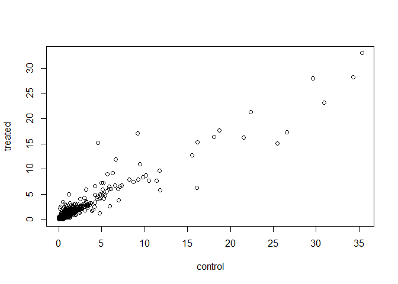
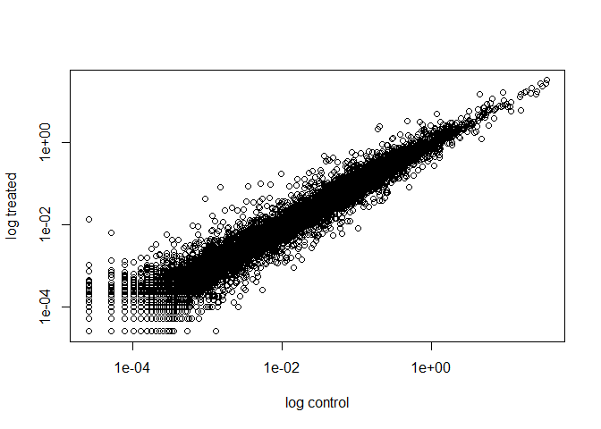
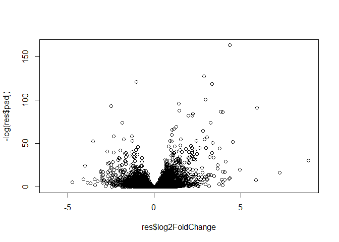
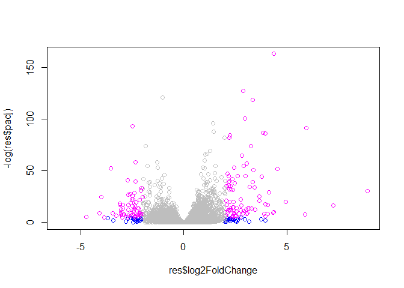

Class 14: RNAseq Analysis
================

Import countData and colData
----------------------------

``` r
counts <- read.csv("data/airway_scaledcounts.csv", stringsAsFactors = FALSE)
metadata <-  read.csv("data/airway_metadata.csv", stringsAsFactors = FALSE)
```

How many genes are in the dataset?

``` r
nrow(counts)
```

    ## [1] 38694

How many counts?

``` r
ncol(counts)
```

    ## [1] 9

8, because 1st column is gene names.

Check metadata to counts correspondence (column to row match).

``` r
all(metadata$id == colnames(counts[-1]))
```

    ## [1] TRUE

Extract control exps (columns of **counts** based on **metadata**)

``` r
#Find the column names (ids) of the 'control' experiments
control.ids <- metadata$id[metadata[,"dex"] == "control"]
control.ids
```

    ## [1] "SRR1039508" "SRR1039512" "SRR1039516" "SRR1039520"

``` r
#Use the ids to extract the control counts columns
control <- counts[,control.ids]
rownames(control) <- counts$ensgene
head(control)
```

    ##                 SRR1039508 SRR1039512 SRR1039516 SRR1039520
    ## ENSG00000000003        723        904       1170        806
    ## ENSG00000000005          0          0          0          0
    ## ENSG00000000419        467        616        582        417
    ## ENSG00000000457        347        364        318        330
    ## ENSG00000000460         96         73        118        102
    ## ENSG00000000938          0          1          2          0

``` r
#Find the column names (ids) of the 'treated' experiments
treated.ids <- metadata$id[metadata[,"dex"] == "treated"]
treated.ids
```

    ## [1] "SRR1039509" "SRR1039513" "SRR1039517" "SRR1039521"

``` r
#Use the ids to extract the treated counts columns
treated <- counts[,treated.ids]
rownames(treated) <- counts$ensgene
head(treated)
```

    ##                 SRR1039509 SRR1039513 SRR1039517 SRR1039521
    ## ENSG00000000003        486        445       1097        604
    ## ENSG00000000005          0          0          0          0
    ## ENSG00000000419        523        371        781        509
    ## ENSG00000000457        258        237        447        324
    ## ENSG00000000460         81         66         94         74
    ## ENSG00000000938          0          0          0          0

Find the mean counts value for each gene in contorl exps.

``` r
control.mean <- rowSums(control)/nrow(control)
head( control.mean)
```

    ## ENSG00000000003 ENSG00000000005 ENSG00000000419 ENSG00000000457 
    ##    0.0931152117    0.0000000000    0.0538067918    0.0351217243 
    ## ENSG00000000460 ENSG00000000938 
    ##    0.0100532382    0.0000775314

Find the mean counts value for each gene in treated exps.

``` r
treated.mean <- rowSums(treated)/nrow(treated)
head( treated.mean)
```

    ## ENSG00000000003 ENSG00000000005 ENSG00000000419 ENSG00000000457 
    ##     0.068020882     0.000000000     0.056442859     0.032718251 
    ## ENSG00000000460 ENSG00000000938 
    ##     0.008140797     0.000000000

``` r
meancounts <- data.frame(control.mean, treated.mean)
colSums(meancounts)
```

    ## control.mean treated.mean 
    ##      2378.18      2294.57

Plot!
=====

``` r
plot(meancounts$control.mean,treated.mean, xlab="control", ylab="treated")
```



Make a log-log plot.

``` r
plot(meancounts$control.mean,treated.mean, log="xy", xlab="log control", ylab="log treated")
```

    ## Warning in xy.coords(x, y, xlabel, ylabel, log): 15032 x values <= 0
    ## omitted from logarithmic plot

    ## Warning in xy.coords(x, y, xlabel, ylabel, log): 15281 y values <= 0
    ## omitted from logarithmic plot



``` r
meancounts$log2fc <- log2(meancounts[,"treated.mean"]/meancounts[,"control.mean"])
head(meancounts)
```

    ##                 control.mean treated.mean      log2fc
    ## ENSG00000000003 0.0931152117  0.068020882 -0.45303916
    ## ENSG00000000005 0.0000000000  0.000000000         NaN
    ## ENSG00000000419 0.0538067918  0.056442859  0.06900279
    ## ENSG00000000457 0.0351217243  0.032718251 -0.10226805
    ## ENSG00000000460 0.0100532382  0.008140797 -0.30441833
    ## ENSG00000000938 0.0000775314  0.000000000        -Inf

We need to filter out zero value entries.

``` r
#meancounts[,1:2]

toy <- c(1, 2, 0, 4, 0)
which(toy  == 0)
```

    ## [1] 3 5

``` r
newtoy <- cbind(toy, toy)
newtoy
```

    ##      toy toy
    ## [1,]   1   1
    ## [2,]   2   2
    ## [3,]   0   0
    ## [4,]   4   4
    ## [5,]   0   0

``` r
newtoy == 0
```

    ##        toy   toy
    ## [1,] FALSE FALSE
    ## [2,] FALSE FALSE
    ## [3,]  TRUE  TRUE
    ## [4,] FALSE FALSE
    ## [5,]  TRUE  TRUE

``` r
which(newtoy == 0, arr.ind = T)
```

    ##      row col
    ## [1,]   3   1
    ## [2,]   5   1
    ## [3,]   3   2
    ## [4,]   5   2

``` r
unique( which(newtoy==0, arr.ind=T)[,1])
```

    ## [1] 3 5

``` r
zero.vals <- which(meancounts[,1:2]==0, arr.ind=TRUE)
head(zero.vals)
```

    ##                 row col
    ## ENSG00000000005   2   1
    ## ENSG00000004848  65   1
    ## ENSG00000004948  70   1
    ## ENSG00000005001  73   1
    ## ENSG00000006059 121   1
    ## ENSG00000006071 123   1

``` r
to.rm <- unique(zero.vals[,1])
mycounts <- meancounts[-to.rm,]
head(mycounts)
```

    ##                 control.mean treated.mean      log2fc
    ## ENSG00000000003   0.09311521  0.068020882 -0.45303916
    ## ENSG00000000419   0.05380679  0.056442859  0.06900279
    ## ENSG00000000457   0.03512172  0.032718251 -0.10226805
    ## ENSG00000000460   0.01005324  0.008140797 -0.30441833
    ## ENSG00000000971   0.53951517  0.691321652  0.35769358
    ## ENSG00000001036   0.24055409  0.184602264 -0.38194109

A common threshold used for calling something differentially expressed is a log2(FoldChange) of greater than 2 or less than -2. Let’s filter the dataset both ways to see how many genes are up or down-regulated.

``` r
up.ind <- mycounts$log2fc > 2
down.ind <- mycounts$log2fc < (-2)

sum(up.ind)
```

    ## [1] 250

``` r
sum(down.ind)
```

    ## [1] 367

250 genes are upregulated over a log2 fold change of 2. 367 genes are downregulated based on that threshold.

What are the upregulated genes?

``` r
head( mycounts[up.ind,])
```

    ##                 control.mean treated.mean   log2fc
    ## ENSG00000004799 0.0279629917 0.1477490050 2.401558
    ## ENSG00000006788 0.0002842818 0.0020416602 2.844349
    ## ENSG00000008438 0.0000516876 0.0002842818 2.459432
    ## ENSG00000011677 0.0000516876 0.0002325942 2.169925
    ## ENSG00000015413 0.0000516876 0.0003101256 2.584963
    ## ENSG00000015592 0.0000516876 0.0002325942 2.169925

Annotate the genes so they are biologically relevant to us.

``` r
anno <- read.csv("data/annotables_grch38.csv")
head(anno)
```

    ##           ensgene entrez   symbol chr     start       end strand
    ## 1 ENSG00000000003   7105   TSPAN6   X 100627109 100639991     -1
    ## 2 ENSG00000000005  64102     TNMD   X 100584802 100599885      1
    ## 3 ENSG00000000419   8813     DPM1  20  50934867  50958555     -1
    ## 4 ENSG00000000457  57147    SCYL3   1 169849631 169894267     -1
    ## 5 ENSG00000000460  55732 C1orf112   1 169662007 169854080      1
    ## 6 ENSG00000000938   2268      FGR   1  27612064  27635277     -1
    ##          biotype
    ## 1 protein_coding
    ## 2 protein_coding
    ## 3 protein_coding
    ## 4 protein_coding
    ## 5 protein_coding
    ## 6 protein_coding
    ##                                                                                                  description
    ## 1                                                          tetraspanin 6 [Source:HGNC Symbol;Acc:HGNC:11858]
    ## 2                                                            tenomodulin [Source:HGNC Symbol;Acc:HGNC:17757]
    ## 3 dolichyl-phosphate mannosyltransferase polypeptide 1, catalytic subunit [Source:HGNC Symbol;Acc:HGNC:3005]
    ## 4                                               SCY1-like, kinase-like 3 [Source:HGNC Symbol;Acc:HGNC:19285]
    ## 5                                    chromosome 1 open reading frame 112 [Source:HGNC Symbol;Acc:HGNC:25565]
    ## 6                          FGR proto-oncogene, Src family tyrosine kinase [Source:HGNC Symbol;Acc:HGNC:3697]

``` r
dim(anno)
```

    ## [1] 66531     9

Let's try the **merge()** function to add the annotations to the data.

``` r
#head(mycounts)
mycounts.anno <- merge(x=mycounts, y=anno, by.x="row.names", by.y="ensgene")
head(mycounts.anno)
```

    ##         Row.names control.mean treated.mean      log2fc entrez   symbol
    ## 1 ENSG00000000003   0.09311521  0.068020882 -0.45303916   7105   TSPAN6
    ## 2 ENSG00000000419   0.05380679  0.056442859  0.06900279   8813     DPM1
    ## 3 ENSG00000000457   0.03512172  0.032718251 -0.10226805  57147    SCYL3
    ## 4 ENSG00000000460   0.01005324  0.008140797 -0.30441833  55732 C1orf112
    ## 5 ENSG00000000971   0.53951517  0.691321652  0.35769358   3075      CFH
    ## 6 ENSG00000001036   0.24055409  0.184602264 -0.38194109   2519    FUCA2
    ##   chr     start       end strand        biotype
    ## 1   X 100627109 100639991     -1 protein_coding
    ## 2  20  50934867  50958555     -1 protein_coding
    ## 3   1 169849631 169894267     -1 protein_coding
    ## 4   1 169662007 169854080      1 protein_coding
    ## 5   1 196651878 196747504      1 protein_coding
    ## 6   6 143494811 143511690     -1 protein_coding
    ##                                                                                                  description
    ## 1                                                          tetraspanin 6 [Source:HGNC Symbol;Acc:HGNC:11858]
    ## 2 dolichyl-phosphate mannosyltransferase polypeptide 1, catalytic subunit [Source:HGNC Symbol;Acc:HGNC:3005]
    ## 3                                               SCY1-like, kinase-like 3 [Source:HGNC Symbol;Acc:HGNC:19285]
    ## 4                                    chromosome 1 open reading frame 112 [Source:HGNC Symbol;Acc:HGNC:25565]
    ## 5                                                     complement factor H [Source:HGNC Symbol;Acc:HGNC:4883]
    ## 6                                          fucosidase, alpha-L- 2, plasma [Source:HGNC Symbol;Acc:HGNC:4008]

``` r
#biocLite("DESeq2")
#biocLite("AnnotationDbi")
#biocLite("org.Hs.eg.db")
```

``` r
library("AnnotationDbi")
```

    ## Loading required package: stats4

    ## Loading required package: BiocGenerics

    ## Loading required package: parallel

    ## 
    ## Attaching package: 'BiocGenerics'

    ## The following objects are masked from 'package:parallel':
    ## 
    ##     clusterApply, clusterApplyLB, clusterCall, clusterEvalQ,
    ##     clusterExport, clusterMap, parApply, parCapply, parLapply,
    ##     parLapplyLB, parRapply, parSapply, parSapplyLB

    ## The following objects are masked from 'package:stats':
    ## 
    ##     IQR, mad, sd, var, xtabs

    ## The following objects are masked from 'package:base':
    ## 
    ##     anyDuplicated, append, as.data.frame, cbind, colMeans,
    ##     colnames, colSums, do.call, duplicated, eval, evalq, Filter,
    ##     Find, get, grep, grepl, intersect, is.unsorted, lapply,
    ##     lengths, Map, mapply, match, mget, order, paste, pmax,
    ##     pmax.int, pmin, pmin.int, Position, rank, rbind, Reduce,
    ##     rowMeans, rownames, rowSums, sapply, setdiff, sort, table,
    ##     tapply, union, unique, unsplit, which, which.max, which.min

    ## Loading required package: Biobase

    ## Welcome to Bioconductor
    ## 
    ##     Vignettes contain introductory material; view with
    ##     'browseVignettes()'. To cite Bioconductor, see
    ##     'citation("Biobase")', and for packages 'citation("pkgname")'.

    ## Loading required package: IRanges

    ## Loading required package: S4Vectors

    ## 
    ## Attaching package: 'S4Vectors'

    ## The following object is masked from 'package:base':
    ## 
    ##     expand.grid

``` r
library("org.Hs.eg.db")
```

    ## 

``` r
columns(org.Hs.eg.db)
```

    ##  [1] "ACCNUM"       "ALIAS"        "ENSEMBL"      "ENSEMBLPROT" 
    ##  [5] "ENSEMBLTRANS" "ENTREZID"     "ENZYME"       "EVIDENCE"    
    ##  [9] "EVIDENCEALL"  "GENENAME"     "GO"           "GOALL"       
    ## [13] "IPI"          "MAP"          "OMIM"         "ONTOLOGY"    
    ## [17] "ONTOLOGYALL"  "PATH"         "PFAM"         "PMID"        
    ## [21] "PROSITE"      "REFSEQ"       "SYMBOL"       "UCSCKG"      
    ## [25] "UNIGENE"      "UNIPROT"

``` r
mycounts$symbol <- mapIds(org.Hs.eg.db,
                     keys=row.names(mycounts),
                     column="SYMBOL",
                     keytype="ENSEMBL",
                     multiVals="first")
```

    ## 'select()' returned 1:many mapping between keys and columns

``` r
library(DESeq2)
```

    ## Loading required package: GenomicRanges

    ## Warning: package 'GenomicRanges' was built under R version 3.4.4

    ## Loading required package: GenomeInfoDb

    ## Loading required package: SummarizedExperiment

    ## Loading required package: DelayedArray

    ## Loading required package: matrixStats

    ## Warning: package 'matrixStats' was built under R version 3.4.4

    ## 
    ## Attaching package: 'matrixStats'

    ## The following objects are masked from 'package:Biobase':
    ## 
    ##     anyMissing, rowMedians

    ## 
    ## Attaching package: 'DelayedArray'

    ## The following objects are masked from 'package:matrixStats':
    ## 
    ##     colMaxs, colMins, colRanges, rowMaxs, rowMins, rowRanges

    ## The following object is masked from 'package:base':
    ## 
    ##     apply

Build our DESeq2 Data Set

``` r
dds <- DESeqDataSetFromMatrix(countData=counts, 
                              colData=metadata, 
                              design=~dex, 
                              tidy=TRUE)
```

    ## converting counts to integer mode

    ## Warning in DESeqDataSet(se, design = design, ignoreRank): some variables in
    ## design formula are characters, converting to factors

``` r
dds
```

    ## class: DESeqDataSet 
    ## dim: 38694 8 
    ## metadata(1): version
    ## assays(1): counts
    ## rownames(38694): ENSG00000000003 ENSG00000000005 ...
    ##   ENSG00000283120 ENSG00000283123
    ## rowData names(0):
    ## colnames(8): SRR1039508 SRR1039509 ... SRR1039520 SRR1039521
    ## colData names(4): id dex celltype geo_id

Run the DESeq Analysis

``` r
dds <- DESeq(dds)
```

    ## estimating size factors

    ## estimating dispersions

    ## gene-wise dispersion estimates

    ## mean-dispersion relationship

    ## final dispersion estimates

    ## fitting model and testing

``` r
res <- results(dds)
res
```

    ## log2 fold change (MLE): dex treated vs control 
    ## Wald test p-value: dex treated vs control 
    ## DataFrame with 38694 rows and 6 columns
    ##                  baseMean log2FoldChange     lfcSE       stat     pvalue
    ##                 <numeric>      <numeric> <numeric>  <numeric>  <numeric>
    ## ENSG00000000003 747.19420    -0.35070283 0.1682342 -2.0846111 0.03710462
    ## ENSG00000000005   0.00000             NA        NA         NA         NA
    ## ENSG00000000419 520.13416     0.20610652 0.1010134  2.0403876 0.04131173
    ## ENSG00000000457 322.66484     0.02452714 0.1451103  0.1690242 0.86577762
    ## ENSG00000000460  87.68263    -0.14714409 0.2569657 -0.5726216 0.56690095
    ## ...                   ...            ...       ...        ...        ...
    ## ENSG00000283115  0.000000             NA        NA         NA         NA
    ## ENSG00000283116  0.000000             NA        NA         NA         NA
    ## ENSG00000283119  0.000000             NA        NA         NA         NA
    ## ENSG00000283120  0.974916     -0.6682308  1.694063 -0.3944544  0.6932456
    ## ENSG00000283123  0.000000             NA        NA         NA         NA
    ##                      padj
    ##                 <numeric>
    ## ENSG00000000003 0.1630257
    ## ENSG00000000005        NA
    ## ENSG00000000419 0.1757326
    ## ENSG00000000457 0.9616577
    ## ENSG00000000460 0.8157061
    ## ...                   ...
    ## ENSG00000283115        NA
    ## ENSG00000283116        NA
    ## ENSG00000283119        NA
    ## ENSG00000283120        NA
    ## ENSG00000283123        NA

Volcano Plot!
=============

Plotting log2 Fold Change and subtracting adjusted p value (padj)

``` r
plot(res$log2FoldChange, -log(res$padj))
```



``` r
mycols <- rep("gray", nrow(res))
mycols[abs(res$log2FoldChange) > 2] = "blue"
subset.inds <- res$padj < 0.01 & abs(res$log2FoldChange) > 2
mycols[subset.inds] <- "magenta"

plot(res$log2FoldChange, -log(res$padj), col=mycols)
```


