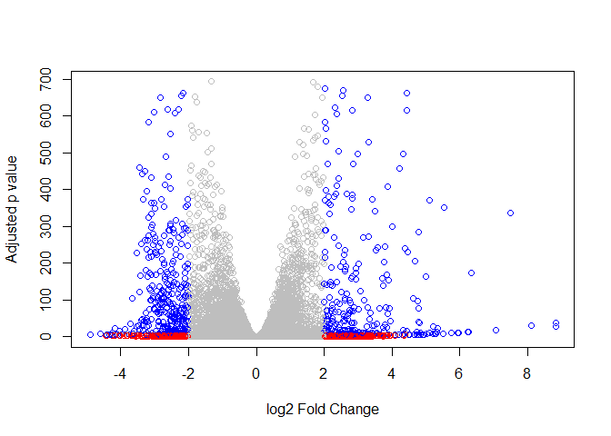

Class 15: Genome Annotation
================

Differential Expression Analysis
--------------------------------

``` r
library(DESeq2)
```

    ## Warning: package 'GenomicRanges' was built under R version 3.4.4

    ## Warning: package 'matrixStats' was built under R version 3.4.4

Load our data files

``` r
metaFile <- "data/GSE37704_metadata.csv"
countFile <- "data/GSE37704_featurecounts.csv"

# Import metadata and take a peak
colData = read.csv(metaFile, row.names=1)
head(colData)
```

    ##               condition
    ## SRR493366 control_sirna
    ## SRR493367 control_sirna
    ## SRR493368 control_sirna
    ## SRR493369      hoxa1_kd
    ## SRR493370      hoxa1_kd
    ## SRR493371      hoxa1_kd

Import count data

``` r
countData = read.csv(countFile, row.names = 1)
head(countData)
```

    ##                 length SRR493366 SRR493367 SRR493368 SRR493369 SRR493370
    ## ENSG00000186092    918         0         0         0         0         0
    ## ENSG00000279928    718         0         0         0         0         0
    ## ENSG00000279457   1982        23        28        29        29        28
    ## ENSG00000278566    939         0         0         0         0         0
    ## ENSG00000273547    939         0         0         0         0         0
    ## ENSG00000187634   3214       124       123       205       207       212
    ##                 SRR493371
    ## ENSG00000186092         0
    ## ENSG00000279928         0
    ## ENSG00000279457        46
    ## ENSG00000278566         0
    ## ENSG00000273547         0
    ## ENSG00000187634       258

Q. Complete the code below to remove the troublesome first column from countData

``` r
nrow(countData)
```

    ## [1] 19808

``` r
dim(countData)
```

    ## [1] 19808     7

``` r
# Note we need to remove the odd first $length col
countData <- as.matrix(countData[,-1])
head(countData)
```

    ##                 SRR493366 SRR493367 SRR493368 SRR493369 SRR493370
    ## ENSG00000186092         0         0         0         0         0
    ## ENSG00000279928         0         0         0         0         0
    ## ENSG00000279457        23        28        29        29        28
    ## ENSG00000278566         0         0         0         0         0
    ## ENSG00000273547         0         0         0         0         0
    ## ENSG00000187634       124       123       205       207       212
    ##                 SRR493371
    ## ENSG00000186092         0
    ## ENSG00000279928         0
    ## ENSG00000279457        46
    ## ENSG00000278566         0
    ## ENSG00000273547         0
    ## ENSG00000187634       258

Check that row and column names match.

``` r
all(rownames(colData) == colnames(countData))
```

    ## [1] TRUE

Remove zero values

``` r
inds <- rowSums(countData) != 0
head(inds)
```

    ## ENSG00000186092 ENSG00000279928 ENSG00000279457 ENSG00000278566 
    ##           FALSE           FALSE            TRUE           FALSE 
    ## ENSG00000273547 ENSG00000187634 
    ##           FALSE            TRUE

``` r
countData = countData[inds, ]
head(countData)
```

    ##                 SRR493366 SRR493367 SRR493368 SRR493369 SRR493370
    ## ENSG00000279457        23        28        29        29        28
    ## ENSG00000187634       124       123       205       207       212
    ## ENSG00000188976      1637      1831      2383      1226      1326
    ## ENSG00000187961       120       153       180       236       255
    ## ENSG00000187583        24        48        65        44        48
    ## ENSG00000187642         4         9        16        14        16
    ##                 SRR493371
    ## ENSG00000279457        46
    ## ENSG00000187634       258
    ## ENSG00000188976      1504
    ## ENSG00000187961       357
    ## ENSG00000187583        64
    ## ENSG00000187642        16

How many genes are left?

``` r
nrow(countData)
```

    ## [1] 15975

We now have 15975 genes remaining in our dataset.

Running DESeq2
--------------

``` r
dds <-  DESeqDataSetFromMatrix(countData=countData,
                             colData=colData,
                             design=~condition)
dds <-  DESeq(dds)
```

    ## estimating size factors

    ## estimating dispersions

    ## gene-wise dispersion estimates

    ## mean-dispersion relationship

    ## final dispersion estimates

    ## fitting model and testing

``` r
res <- results(dds)
head(res)
```

    ## log2 fold change (MLE): condition hoxa1 kd vs control sirna 
    ## Wald test p-value: condition hoxa1 kd vs control sirna 
    ## DataFrame with 6 rows and 6 columns
    ##                   baseMean log2FoldChange      lfcSE        stat
    ##                  <numeric>      <numeric>  <numeric>   <numeric>
    ## ENSG00000279457   29.91358     0.17927483 0.32459294   0.5523066
    ## ENSG00000187634  183.22965     0.42644724 0.14017817   3.0421802
    ## ENSG00000188976 1651.18808    -0.69272061 0.05484412 -12.6307172
    ## ENSG00000187961  209.63794     0.72975918 0.13178350   5.5375609
    ## ENSG00000187583   47.25512     0.04055411 0.27169055   0.1492658
    ## ENSG00000187642   11.97975     0.54275443 0.52117592   1.0414035
    ##                       pvalue         padj
    ##                    <numeric>    <numeric>
    ## ENSG00000279457 5.807383e-01 6.861959e-01
    ## ENSG00000187634 2.348712e-03 5.125918e-03
    ## ENSG00000188976 1.429691e-36 1.751520e-35
    ## ENSG00000187961 3.067131e-08 1.113384e-07
    ## ENSG00000187583 8.813439e-01 9.190071e-01
    ## ENSG00000187642 2.976883e-01 4.029782e-01

Volcano Plot!
-------------

``` r
mycols <- rep("gray", nrow(res))
mycols[ abs(res$log2FoldChange) > 2 ] <- "red"


inds.col <- res$padj < 0.01 & (abs(res$log2FoldChange) > 2 )
mycols[inds.col] <- "blue"
plot(res$log2FoldChange, -log(res$padj), xlab = "log2 Fold Change", ylab = "Adjusted p value", col = mycols)
```



Q. Use the mapIDs() function multiple times to add SYMBOL, ENTREZID and GENENAME annotation to our results by completing the code below.

``` r
library("AnnotationDbi")
library("org.Hs.eg.db")
```

``` r
columns(org.Hs.eg.db)
```

    ##  [1] "ACCNUM"       "ALIAS"        "ENSEMBL"      "ENSEMBLPROT" 
    ##  [5] "ENSEMBLTRANS" "ENTREZID"     "ENZYME"       "EVIDENCE"    
    ##  [9] "EVIDENCEALL"  "GENENAME"     "GO"           "GOALL"       
    ## [13] "IPI"          "MAP"          "OMIM"         "ONTOLOGY"    
    ## [17] "ONTOLOGYALL"  "PATH"         "PFAM"         "PMID"        
    ## [21] "PROSITE"      "REFSEQ"       "SYMBOL"       "UCSCKG"      
    ## [25] "UNIGENE"      "UNIPROT"

``` r
res$symbol = mapIds(org.Hs.eg.db,
                    keys=row.names(res), 
                    keytype="ENSEMBL",
                    column="SYMBOL",
                    multiVals="first")
```

    ## 'select()' returned 1:many mapping between keys and columns

``` r
res$entrez = mapIds(org.Hs.eg.db,
                    keys=row.names(res),
                    keytype="ENSEMBL",
                    column="ENTREZID",
                    multiVals="first")
```

    ## 'select()' returned 1:many mapping between keys and columns

``` r
res$name =   mapIds(org.Hs.eg.db,
                    keys=row.names(res),
                    keytype="ENSEMBL",
                    column="GENENAME",
                    multiVals="first")
```

    ## 'select()' returned 1:many mapping between keys and columns

``` r
head(res, 10)
```

    ## log2 fold change (MLE): condition hoxa1 kd vs control sirna 
    ## Wald test p-value: condition hoxa1 kd vs control sirna 
    ## DataFrame with 10 rows and 9 columns
    ##                     baseMean log2FoldChange      lfcSE        stat
    ##                    <numeric>      <numeric>  <numeric>   <numeric>
    ## ENSG00000279457   29.9135794     0.17927483 0.32459294   0.5523066
    ## ENSG00000187634  183.2296499     0.42644724 0.14017817   3.0421802
    ## ENSG00000188976 1651.1880762    -0.69272061 0.05484412 -12.6307172
    ## ENSG00000187961  209.6379385     0.72975918 0.13178350   5.5375609
    ## ENSG00000187583   47.2551233     0.04055411 0.27169055   0.1492658
    ## ENSG00000187642   11.9797502     0.54275443 0.52117592   1.0414035
    ## ENSG00000188290  108.9221280     2.05704993 0.19679801  10.4525953
    ## ENSG00000187608  350.7168680     0.25737707 0.10267368   2.5067482
    ## ENSG00000188157 9128.4394220     0.38990881 0.04673847   8.3423530
    ## ENSG00000237330    0.1581924     0.78595521 4.08047286   0.1926138
    ##                       pvalue         padj       symbol      entrez
    ##                    <numeric>    <numeric>  <character> <character>
    ## ENSG00000279457 5.807383e-01 6.861959e-01 LOC102723897   102723897
    ## ENSG00000187634 2.348712e-03 5.125918e-03       SAMD11      148398
    ## ENSG00000188976 1.429691e-36 1.751520e-35        NOC2L       26155
    ## ENSG00000187961 3.067131e-08 1.113384e-07       KLHL17      339451
    ## ENSG00000187583 8.813439e-01 9.190071e-01      PLEKHN1       84069
    ## ENSG00000187642 2.976883e-01 4.029782e-01        PERM1       84808
    ## ENSG00000188290 1.425695e-25 1.230205e-24         HES4       57801
    ## ENSG00000187608 1.218475e-02 2.365993e-02        ISG15        9636
    ## ENSG00000188157 7.282667e-17 4.361314e-16         AGRN      375790
    ## ENSG00000237330 8.472615e-01           NA       RNF223      401934
    ##                                                                     name
    ##                                                              <character>
    ## ENSG00000279457                        WAS protein family homolog 2-like
    ## ENSG00000187634                 sterile alpha motif domain containing 11
    ## ENSG00000188976 NOC2 like nucleolar associated transcriptional repressor
    ## ENSG00000187961                              kelch like family member 17
    ## ENSG00000187583                 pleckstrin homology domain containing N1
    ## ENSG00000187642             PPARGC1 and ESRR induced regulator, muscle 1
    ## ENSG00000188290                   hes family bHLH transcription factor 4
    ## ENSG00000187608                            ISG15 ubiquitin-like modifier
    ## ENSG00000188157                                                    agrin
    ## ENSG00000237330                                  ring finger protein 223

Q. Finally for this section let’s reorder these results by adjusted p-value and save them to a CSV file in your current project directory.

``` r
res = res[order(res$pvalue),]
write.csv(res, file="deseq_results.csv")
```

Section 2: Pathway Analysis
---------------------------

``` r
library(pathview)
library(gage)
library(gageData)
```

``` r
data(kegg.sets.hs)
data(sigmet.idx.hs)

# Focus on signaling and metabolic pathways only
kegg.sets.hs = kegg.sets.hs[sigmet.idx.hs]

# Examine the first 3 pathways
head(kegg.sets.hs, 3)
```

    ## $`hsa00232 Caffeine metabolism`
    ## [1] "10"   "1544" "1548" "1549" "1553" "7498" "9"   
    ## 
    ## $`hsa00983 Drug metabolism - other enzymes`
    ##  [1] "10"     "1066"   "10720"  "10941"  "151531" "1548"   "1549"  
    ##  [8] "1551"   "1553"   "1576"   "1577"   "1806"   "1807"   "1890"  
    ## [15] "221223" "2990"   "3251"   "3614"   "3615"   "3704"   "51733" 
    ## [22] "54490"  "54575"  "54576"  "54577"  "54578"  "54579"  "54600" 
    ## [29] "54657"  "54658"  "54659"  "54963"  "574537" "64816"  "7083"  
    ## [36] "7084"   "7172"   "7363"   "7364"   "7365"   "7366"   "7367"  
    ## [43] "7371"   "7372"   "7378"   "7498"   "79799"  "83549"  "8824"  
    ## [50] "8833"   "9"      "978"   
    ## 
    ## $`hsa00230 Purine metabolism`
    ##   [1] "100"    "10201"  "10606"  "10621"  "10622"  "10623"  "107"   
    ##   [8] "10714"  "108"    "10846"  "109"    "111"    "11128"  "11164" 
    ##  [15] "112"    "113"    "114"    "115"    "122481" "122622" "124583"
    ##  [22] "132"    "158"    "159"    "1633"   "171568" "1716"   "196883"
    ##  [29] "203"    "204"    "205"    "221823" "2272"   "22978"  "23649" 
    ##  [36] "246721" "25885"  "2618"   "26289"  "270"    "271"    "27115" 
    ##  [43] "272"    "2766"   "2977"   "2982"   "2983"   "2984"   "2986"  
    ##  [50] "2987"   "29922"  "3000"   "30833"  "30834"  "318"    "3251"  
    ##  [57] "353"    "3614"   "3615"   "3704"   "377841" "471"    "4830"  
    ##  [64] "4831"   "4832"   "4833"   "4860"   "4881"   "4882"   "4907"  
    ##  [71] "50484"  "50940"  "51082"  "51251"  "51292"  "5136"   "5137"  
    ##  [78] "5138"   "5139"   "5140"   "5141"   "5142"   "5143"   "5144"  
    ##  [85] "5145"   "5146"   "5147"   "5148"   "5149"   "5150"   "5151"  
    ##  [92] "5152"   "5153"   "5158"   "5167"   "5169"   "51728"  "5198"  
    ##  [99] "5236"   "5313"   "5315"   "53343"  "54107"  "5422"   "5424"  
    ## [106] "5425"   "5426"   "5427"   "5430"   "5431"   "5432"   "5433"  
    ## [113] "5434"   "5435"   "5436"   "5437"   "5438"   "5439"   "5440"  
    ## [120] "5441"   "5471"   "548644" "55276"  "5557"   "5558"   "55703" 
    ## [127] "55811"  "55821"  "5631"   "5634"   "56655"  "56953"  "56985" 
    ## [134] "57804"  "58497"  "6240"   "6241"   "64425"  "646625" "654364"
    ## [141] "661"    "7498"   "8382"   "84172"  "84265"  "84284"  "84618" 
    ## [148] "8622"   "8654"   "87178"  "8833"   "9060"   "9061"   "93034" 
    ## [155] "953"    "9533"   "954"    "955"    "956"    "957"    "9583"  
    ## [162] "9615"

Set up input for **gage()**

``` r
foldchanges <-  res$log2FoldChange
names(foldchanges) <- res$entrez
head(foldchanges)
```

    ##      1266     54855      1465     51232      2034      2317 
    ## -2.422719  3.201955 -2.313737 -2.059631 -1.888019 -1.649792

Get the results

``` r
keggres = gage(foldchanges, gsets=kegg.sets.hs)
```

``` r
attributes(keggres)
```

    ## $names
    ## [1] "greater" "less"    "stats"

Look at the first few down (less) pathways

``` r
head(keggres$less)
```

    ##                                      p.geomean stat.mean        p.val
    ## hsa04110 Cell cycle               8.995997e-06 -4.378637 8.995997e-06
    ## hsa03030 DNA replication          9.424242e-05 -3.951797 9.424242e-05
    ## hsa03013 RNA transport            1.375940e-03 -3.028491 1.375940e-03
    ## hsa03440 Homologous recombination 3.066785e-03 -2.852895 3.066785e-03
    ## hsa04114 Oocyte meiosis           3.861374e-03 -2.691482 3.861374e-03
    ## hsa00240 Pyrimidine metabolism    7.764955e-03 -2.442262 7.764955e-03
    ##                                         q.val set.size         exp1
    ## hsa04110 Cell cycle               0.001448356      121 8.995997e-06
    ## hsa03030 DNA replication          0.007586515       36 9.424242e-05
    ## hsa03013 RNA transport            0.073842091      144 1.375940e-03
    ## hsa03440 Homologous recombination 0.123438078       28 3.066785e-03
    ## hsa04114 Oocyte meiosis           0.124336257      101 3.861374e-03
    ## hsa00240 Pyrimidine metabolism    0.206119290       96 7.764955e-03

``` r
pathview(gene.data=foldchanges, pathway.id="hsa04110")
```

    ## 'select()' returned 1:1 mapping between keys and columns

    ## Info: Working in directory C:/Users/erica/Desktop/BGGN 213 - Bioinformatics/BGGN 213 W19/BGGN-213-Classwork_github/Class15

    ## Info: Writing image file hsa04110.pathview.png

To create a link, square bracket around word(s), followed by parens around url. "[link]()"

To insert an image, begin same format with a "!" and empty square brackets.


Section 3:Gene Ontology
-----------------------

``` r
data(go.sets.hs)
data(go.subs.hs)

# Focus on Biological Process (BP) subset of GO
gobpsets <- go.sets.hs[go.subs.hs$BP]

gobpres <- gage(foldchanges, gsets=gobpsets, same.dir=TRUE)

lapply(gobpres, head)
```

    ## $greater
    ##                                              p.geomean stat.mean
    ## GO:0007156 homophilic cell adhesion       8.520651e-05  3.824177
    ## GO:0002009 morphogenesis of an epithelium 1.396812e-04  3.653861
    ## GO:0048729 tissue morphogenesis           1.432629e-04  3.643210
    ## GO:0007610 behavior                       2.390650e-04  3.507254
    ## GO:0060562 epithelial tube morphogenesis  5.933392e-04  3.261348
    ## GO:0035295 tube development               5.953946e-04  3.253631
    ##                                                  p.val     q.val set.size
    ## GO:0007156 homophilic cell adhesion       8.520651e-05 0.1952673      113
    ## GO:0002009 morphogenesis of an epithelium 1.396812e-04 0.1952673      339
    ## GO:0048729 tissue morphogenesis           1.432629e-04 0.1952673      424
    ## GO:0007610 behavior                       2.390650e-04 0.2443842      428
    ## GO:0060562 epithelial tube morphogenesis  5.933392e-04 0.3712232      257
    ## GO:0035295 tube development               5.953946e-04 0.3712232      391
    ##                                                   exp1
    ## GO:0007156 homophilic cell adhesion       8.520651e-05
    ## GO:0002009 morphogenesis of an epithelium 1.396812e-04
    ## GO:0048729 tissue morphogenesis           1.432629e-04
    ## GO:0007610 behavior                       2.390650e-04
    ## GO:0060562 epithelial tube morphogenesis  5.933392e-04
    ## GO:0035295 tube development               5.953946e-04
    ## 
    ## $less
    ##                                             p.geomean stat.mean
    ## GO:0048285 organelle fission             1.661723e-15 -8.053470
    ## GO:0000280 nuclear division              4.640536e-15 -7.928484
    ## GO:0007067 mitosis                       4.640536e-15 -7.928484
    ## GO:0000087 M phase of mitotic cell cycle 1.262591e-14 -7.787044
    ## GO:0007059 chromosome segregation        2.028490e-11 -6.878352
    ## GO:0000236 mitotic prometaphase          2.025743e-10 -6.666762
    ##                                                 p.val        q.val
    ## GO:0048285 organelle fission             1.661723e-15 6.325050e-12
    ## GO:0000280 nuclear division              4.640536e-15 6.325050e-12
    ## GO:0007067 mitosis                       4.640536e-15 6.325050e-12
    ## GO:0000087 M phase of mitotic cell cycle 1.262591e-14 1.290683e-11
    ## GO:0007059 chromosome segregation        2.028490e-11 1.658899e-08
    ## GO:0000236 mitotic prometaphase          2.025743e-10 1.380544e-07
    ##                                          set.size         exp1
    ## GO:0048285 organelle fission                  376 1.661723e-15
    ## GO:0000280 nuclear division                   352 4.640536e-15
    ## GO:0007067 mitosis                            352 4.640536e-15
    ## GO:0000087 M phase of mitotic cell cycle      362 1.262591e-14
    ## GO:0007059 chromosome segregation             142 2.028490e-11
    ## GO:0000236 mitotic prometaphase                84 2.025743e-10
    ## 
    ## $stats
    ##                                           stat.mean     exp1
    ## GO:0007156 homophilic cell adhesion        3.824177 3.824177
    ## GO:0002009 morphogenesis of an epithelium  3.653861 3.653861
    ## GO:0048729 tissue morphogenesis            3.643210 3.643210
    ## GO:0007610 behavior                        3.507254 3.507254
    ## GO:0060562 epithelial tube morphogenesis   3.261348 3.261348
    ## GO:0035295 tube development                3.253631 3.253631
